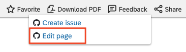

# The Overall Process

This section describes the overall process for a pull request based content contribution. For a high-level view of contributions, see [Contributing to SAP documentation](../contributing.md).

## Starting Point

The overall process for content contribution starts with you.

1. You're reading documentation on [SAP Help Portal](http://help.sap.com). You come across something you're not sure is entirely accurate, or you've spotted a typo, or you think that there's a small addition or amendment that you can offer that would help clarify or otherwise add value to what's already there.

2. You check to see if that particular documentation on SAP Help Portal is open for collaboration. Whether it is or not depends if the documentation set to which the page belongs is enrolled in the SAP collaborative documentation initiative.

3. You see that the appropriate link is available on that particular page, offering the chance to collaborate by contributing content:

Great, you're all set to start.

## What You're Going to Do

Your intention here is to offer a small contribution of content, by making the appropriate change to the document source, and submitting that change.

The document source is in a lightweight markup language called [Markdown][markdown]. The language is simple enough to master and can be edited in any plain text editor.

The change that you make is automatically managed by [Git][git], which is software for tracking changes in files. Specifically, Git is a distributed version control system in widespread use for all manner of software and other text-based content projects, and is at the heart of the software development, version control and collaborative authoring and coding platform [GitHub][github]. Your activities in this process are managed on that platform. More precisely still, the change (or set of changes, that should all relate to the same logical offering of content contribution) is recorded in the form of one or more Git [commits][commit].

Your will offer your change, which will be in the form of one or more commits, bundled into a [pull request][github-pull-request]. Think of a pull request as the collaborative side of the change, in which you present the change in a context that can be assessed, viewed, tracked, and discussed.

The pull request is the representation of your contribution, and is a request for the appropriate SAP documentation team to consider your changes. Moreover, it is a request, if the changes are acceptable and appropriate, to merge (that is to "pull") that change into their SAP-owned and maintained set of sources.

The pull request's status reflects the situation at any given time:

- Open: the pull request has been created and submitted. This status remains also throughout the entire contribution discussion.
- Merged: the pull request was deemed acceptable and the changes therein have been merged into the main set of sources.
- Closed: the pull request is no longer under consideration and the changes have not been merged. This is the case where the changes offered were not appropriate or the circumstances, in which the change originally might have made sense, are now different.

While your pull request is in the Open status, there is conversation to be had and your content contribution offering is either new or still actively being considered.

Once your pull request is either in the Merged or Closed status, that's the end of the story for that particular contribution.

[sap-help-portal]: https://help.sap.com
[markdown]: https://en.wikipedia.org/wiki/Markdown
[git]: https://en.wikipedia.org/wiki/Git
[github]: https://github.com
[commit]: https://en.wikipedia.org/wiki/Commit_(version_control)
[github-pull-request]: https://docs.github.com/en/github/collaborating-with-issues-and-pull-requests/about-pull-requests
