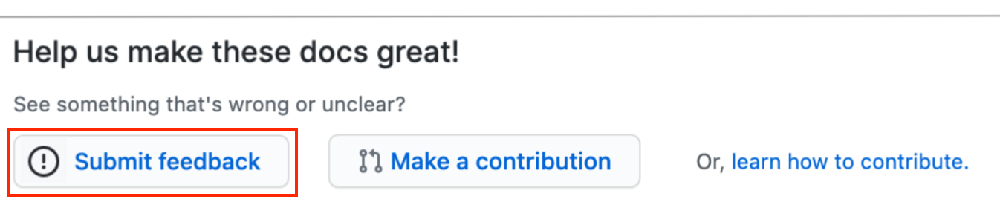
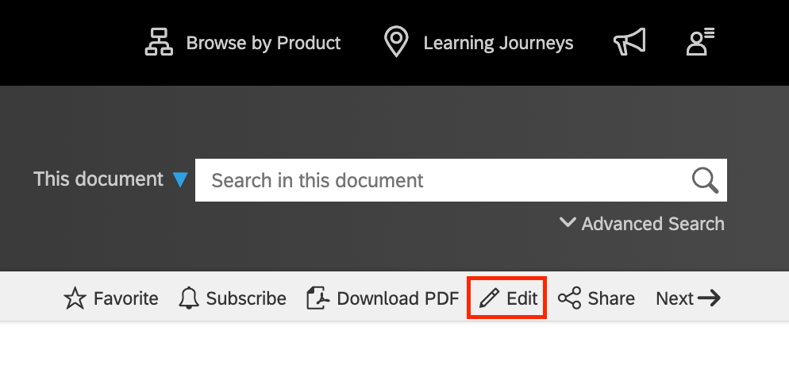

# Contributing to SAP Documentation

SAP documentation is a valuable asset and benefits everyone. While the ownership and responsibility will always remain with SAP for the content, we recognize that the wider community can help make our documentation better.

Your regular use of SAP documentation affords you a pragmatic experience that is unmatched, and we want to make use of that experience to improve our documentation. We would very much like you to collaborate with us to do that, by offering you the ability to submit contributions.

Understand that we are not looking for you to take over the authoring of content for us; rather, we value your feedback and eye for detail and realize that collaboration has many advantages here.

There are two ways in which you can contribute to SAP documentation. Briefly, there's feedback, and there's content contribution.

> Availability of these two contribution types varies. Sometimes only feedback is available, sometimes only content contribution is available, sometimes both, and sometimes neither. It all depends on the team managing the documentation set.

## GitHub Account

Both feedback and content contributions are facilitated via mechanisms in GitHub. Specifically, feedback contributions are made via [GitHub issues][github-issues], and content contributions are made via [pull requests][github-pull-requests].

This means that in order to contribute, you need a GitHub account. Read more about the signup process in the article [Signing up for a new GitHub account][github-signup]. A simple individual user account suffices.

## Types of Contribution

As mentioned earlier, there are two ways in which you can contribute to SAP documentation - either by providing feedback, or by offering a contribution of content.

### Providing Feedback

We value feedback on our documentation, and want to make it possible for you to do that in a simple but structured way.

Where feedback is possible for a page, you'll see an appropriate link at the bottom of the page, inviting you to contribute feedback.

Following the link takes you to the "New Issue" page in GitHub, specifically for the repository containing the SAP documentation content for which you want to provide feedback.

Note that some technical information is automatically added to the main feedback edit area (in other words, in the body of the issue). This associates your feedback with the appropriate page in the documentation. Ensure that when creating a new feedback issue, that you add your feedback to the issue without removing any of that technical information. Also, limit your feedback to the content of that single documentation page.

For more details about making a feedback contribution, see [Contributing feedback via issues](feedback.md).

### Contributing Content 

In some cases, we want to make it possible for you to contribute by providing small amounts of content. We're not asking or expecting you to come up with entirely new sections; rather, we're opening up the opportunity for you to contribute to SAP documentation by offering content such as:

- Corrections to typos that you spot.
- The rewording of a phrase or sentence for clarity.
- The addition of information or context to qualify or increase accuracy.

If you spot something that's missing, incorrect, lacking clarity or requiring more context, you can provide feedback via an issue, and ask us to address it.

But with content contribution, you have the opportunity to collaborate with us by adding that missing information, correcting that mistake, or providing that clarification.

Where content contribution is available, you'll see a link like this:

If you're already familiar with pull request based collaboration on GitHub, then this process will be familiar to you. If not, don't worry, it's straightforward, and the GitHub workflow infrastructure, combined with how we use it for collaboration on SAP documentation, makes the process easy for you to follow.

Briefly, here's what a typical pull request based content contribution workflow entails. Note that you start out on the SAP Help Portal, but are taken to the corresponding SAP documentation repository, within the [SAP-docs][sap-docs-org] organization on GitHub, where most of the collaboration workflow steps take place. Note also that some details have been omitted here for brevity but you can find those details in [How to contribute content](content-contribution/README.md).

**In the SAP Help Portal**

1. Your starting point is in the SAP Help Portal, and you're looking at a page of SAP documentation.

2. You spot something in the page that you think would benefit from a minor modification or addition.

3. You check for, find, and follow the link that allows you to make a content contribution.

**In GitHub**

4. You're taken to the source of the SAP documentation page, on GitHub, where you can confirm that this is indeed the page to which you want to make a contribution.

5. You use the "✎ Edit" link to launch the browser-based editor for that page, and make your contribution.

6. Once you're happy with your contribution, and have saved the changes you've made, you're guided through the process of creating a pull request. A pull request is the unit of conversation that combines the actual details of your content contribution offering with the conversation that will then take place between you and the team responsible for the SAP documentation page in question.

7. During that conversation, various checks are made, some automated, some human-based, to confirm whether the contribution is appropriate and will add value. A successful contribution is merged into the SAP documentation page source and the pull request is then closed.

**Back in the SAP Help Portal**

8. For those content contributions that are successful, the changes are eventually merged back into the source repository in the [SAP-docs][sap-docs-org] organization. From there, it's only a matter of time before those changes then also appear on the page in the SAP Help Portal.

9. Congratulations - you've just collaborated with us and made a valuable contribution to SAP documentation. Thank you!

For more details about making a content contribution, see [How to contribute content](content/README.md).

[github-issues]: https://guides.github.com/features/issues/
[github-pull-requests]: https://docs.github.com/en/github/collaborating-with-issues-and-pull-requests/about-pull-requests
[github-signup]: https://docs.github.com/en/github/getting-started-with-github/signing-up-for-a-new-github-account
[sap-docs-org]: https://github.com/SAP-docs/