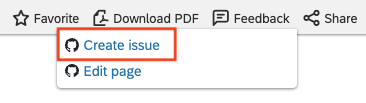

# Contributing to SAP Documentation

SAP documentation is a valuable asset and benefits everyone. While the ownership and responsibility will always remain with SAP for the content, we recognize that the wider community can help make our documentation better.

Your regular use of SAP documentation puts you in a unique position to share your knowledge and help us improve our documentation. We would very much like you to collaborate with us to do that, by offering you the ability to submit contributions.

Understand that we are not looking for you to take over the authoring of content for us; rather, we value your feedback and eye for detail and realize that collaboration has many advantages here.

There are two ways in which you can contribute to SAP documentation. Briefly, there's feedback, and there's content contribution.

> The availability of these two contribution types varies. Sometimes only feedback is available, sometimes only content contribution is available, sometimes both, and sometimes neither. It all depends on the team managing the documentation set.

## GitHub Account

Both feedback and content contributions are facilitated via mechanisms in GitHub. Specifically, feedback contributions are made via [GitHub issues][github-issues], and content contributions are made via [pull requests][github-pull-requests].

This means that in order to contribute, you need a GitHub account. Read more about the signup process in the article [Signing up for a new GitHub account][github-signup]. A simple individual user account is enough.

## Types of Contribution

As mentioned earlier, there are two ways in which you can contribute to SAP documentation - either by providing feedback, or by contributing content.

### Providing Feedback

We value feedback on our documentation, and want to make it possible for you to do that in a simple but structured way.

Where feedback is possible for a page, you'll see a link inviting you to provide feedback.

Following the link takes you to the *New Issue* page in GitHub, specifically for the repository containing the SAP documentation content for which you want to provide feedback.

For more details about providing feedback, see [How to Provide Feedback](feedback.md).

### Contributing Content 

In some cases, we want to make it possible for you to contribute by providing small pieces of content. We're not asking or expecting you to come up with entirely new sections; rather, we're opening up the opportunity for you to contribute to SAP documentation by offering content such as additional information or context to increase accuracy, or even simply some rewording to improve clarity.
to
If you spot something that's missing, incorrect, lacking clarity or requiring more context, you can of course provide feedback via an issue, and ask us to address it. But with content contribution, you have the opportunity to collaborate with us by adding that missing information, providing that clarification, or correcting that mistake.

Where content contribution is available, you'll see a link like this:

If you're already familiar with pull request based collaboration on GitHub, then this process will be familiar to you. If not, don't worry, it's straightforward, and the GitHub workflow infrastructure, combined with how we use it for collaboration on SAP documentation, makes the process easy for you to follow.

Briefly, here's what a typical pull request based content contribution workflow entails. Note that you start out on the SAP Help Portal, but are taken to the corresponding SAP documentation repository, within the [SAP-docs][sap-docs-org] organization on GitHub, where the collaboration workflow steps take place. Note also that some details have been omitted here for brevity but you can find those details in [How to Contribute Content](content-contribution/README.md).

**In the SAP Help Portal**

You spot something on a page in the SAP Help Portal to which you wish to make a contibution, and you select the **Edit** link.

**In GitHub**

You make your contribution. After you save your changes, you are guided through the process of creating a pull request. The team responsible for the documentation sees your request and checks it for appropriateness. A successful contribution is merged into the SAP documentation page source.

For more details about contributing content, see [How to contribute content](content/README.md).

## Keeping Track of Your Contributions

You can use standard GitHub functionality to keep track of the issues your raise and the pull requests that you open, by using filters. See [Finding information in a repository](https://docs.github.com/en/github/managing-your-work-on-github/finding-information-in-a-repository) for more details.

You can also stay informed, by using notifications. See [Setting up notifications](https://docs.github.com/en/github/managing-subscriptions-and-notifications-on-github/setting-up-notifications) to find out how.

## Material Ownership and Use

SAP does not claim ownership of the materials you provide (including feedback and suggested content contributions). However, by providing feedback or submitting content contributions you are granting SAP permission to use that material. In addition, SAP is under no obligation to use the feedback you provide or the content contributions you submit.

[github-issues]: https://guides.github.com/features/issues/
[github-pull-requests]: https://docs.github.com/en/github/collaborating-with-issues-and-pull-requests/about-pull-requests
[github-signup]: https://docs.github.com/en/github/getting-started-with-github/signing-up-for-a-new-github-account
[sap-docs-org]: https://github.com/SAP-docs/
