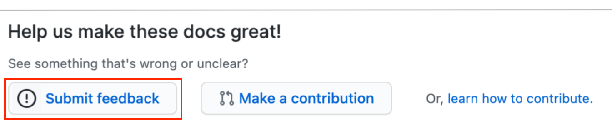

# Contributing to SAP documentation

SAP documentation is an extremely valuable asset and benefits everyone. While the ownership and responsibility will always remain with SAP for the content, we recognize that the wider community can help make our documentation better.

Your regular use of SAP documentation affords you a pragmatic experience that is unmatched, and we want to make use of that experience to improve our documentation. We would very much like you to collaborate with us to do that, by offering you the ability to submit contributions.

Understand that we are not looking for you to take over the authoring of content for us; rather, we value your feedback and eye for detail and realize that collaboration has many advantages here.

There are two ways in which you can contribute to SAP documentation. Briefly, there is feedback, and there is content contribution.

> Availability of these two contribution types will depend on the documentation in question. Sometimes only feedback will be available, sometimes only content contribution will be available, sometimes both, and sometimes neither. It all depends on the team managing the documentation set.

## GitHub account

Both feedback and content contributions are facilitated via mechanisms in GitHub. Specifically, feedback contributions are made via [GitHub issues][github-issues], and content contributions are made via [pull requests][github-pull-requests].

This means that in order to contribute, you will need a GitHub account. Read more about the signup process in the article [Signing up for a new GitHub account][github-signup]. A simple individual user account will suffice.

## Types of contribution

As mentioned earlier, there are two ways in which you can contribute to SAP documentation - either by providing feedback, or by offering a contribution of content.

### Feedback

We value feedback on our documentation, and want to make it possible for you to do that in a simple but structured way.

Where feedback is possible for a page, you will see an appropriate link at the bottom of the page, inviting you to contribute feedback.

Following the link will take you to the "New Issue" page in GitHub, specifically for the repository containing the SAP documentation content that for which you want to provide feedback.

Note that there will be some content automatically added to the main feedback edit area; this is to provide us with a way of associating the feedback you are providing with the appropriate page in the documentation. This is very important in two respects:

1. you should not remove any of this information
1. the implication is that feedback should be for a specific SAP documentation page, rather than generally

So, please ensure that when creating a new feedback issue, that you add your feedback to the issue without removing any of the technical information that has been put there automatically, and limit your feedback to the content in the page for which you are providing feedback.

For more details about making a feedback contribution, please see [Contributing feedback via issues](feedback.md).

- [Contributing content via pull requests](content.md)

[github-issues]: https://guides.github.com/features/issues/
[github-pull-requests]: https://docs.github.com/en/github/collaborating-with-issues-and-pull-requests/about-pull-requests
[github-signup]: https://docs.github.com/en/github/getting-started-with-github/signing-up-for-a-new-github-account
