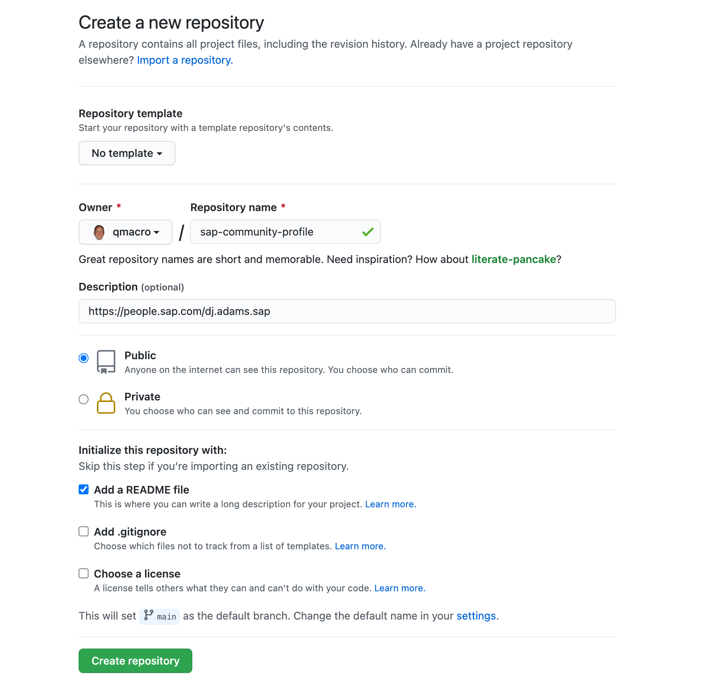
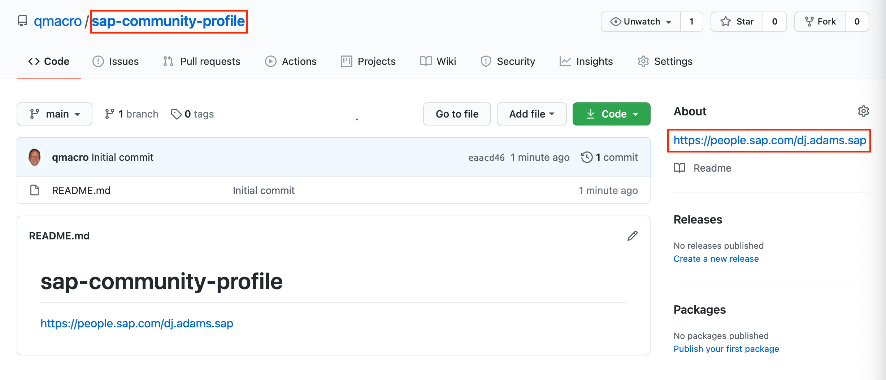

# Contribution recognition

We want to recognize valuable contributions. In the [SAP Community][sap-community] there is a wide variety of [missions and badges][missions-badges] and this is valuable community contributions to documentation will also be recognized.

## Badges

In the [SAP Community][sap-community] there are two badges relating to community contributions to documentation.

There is a "Documentation feedback contribution" badge, which will be awarded if you have contributed feedback in the form of an issue, which has subsequently led to an improvement in the documentation.

There is also a "Documentation content contribution" badge, which will be awarded if you have contributed content via the pull request method. In order to qualify, that pull request has to have been merged and your content contribution included in the documentation.

## Linking profiles

While recognition is made in the [SAP Community][sap-community], the contribution activities themselves take place in [GitHub][github]. This means that in order to award a badge, a link is required that associates your GitHub profile with your SAP Community profile. This is so that qualifying contribution activities in GitHub can be recognized correctly for you in the SAP Community.

It is your responsibility to create and maintain this link, as you are in control of your GitHub identity. The process is straightforward, and involves the creation of a public repository on GitHub named `sap-community-profile`, with the URL of your SAP Community profile in the description of that repository.

### Step by step

This is what you need to do to create the link. An example is shown below.

1. [Create a new repository][github-new] called `sap-community-profile`. The name *must* be as shown, i.e. `sap-community-profile`. Any other name will mean that the link between your GitHub and SAP Community profiles will not be able to be determined.

1. In the new repository's Description field, put the URL (and only the URL) of your SAP Community profile. This will be made up of the base URL `https://people.sap.com/` followed by your SAP Community ID.

1. Select to initialize the repository with a README file, by marking the corresponding checkbox. This is so you and others will know what the (otherwise) empty repository is for.

1. Initiate the creation of the repository with the "Create repository" button.

Once your repository is created, it will look something like this:

Ensure that the two critical aspects (highlighted) are correct for your repository.

Once the repository exists and is in the form described here, recognition in the SAP Community will be possible.

[sap-community]: https://community.sap.com
[missions-badges]: https://community.sap.com/resources/missions-badges
[github]: https://github.com
[github-new]: https://github.com/new
